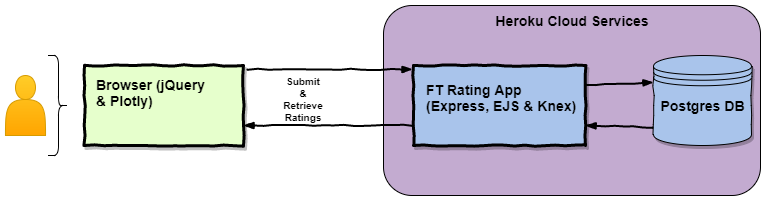

[](https://travis-ci.org/reenz/FT_tech_test)


## FT Cloud Engineer Technical Exercise

This is a tech test for Financial Times. I will build a website that asks for and stores a simple rating score for using ft.com. This website will be will hosted on Heroku .

#### User Stories
```
As a user
So that I can share my experience of using ft.com
I'd like to rate the website

As a user
So that I can see the popularity of ft.com
I'd like to see all the ratings
```

### Architecture diagram




### Required features

* Build a website 
* Store the Rating 
* Host on cloud 
* Diagram of the site architecture

### Optional features

* Templated infrastructure as code
* Automated testing 
* Origami Components/FT look and feel 
* The ability to view ratings/results 

### Running the application locally

Local development of this FT rating web application assumes the following are already installed:

1. PostgreSQL database
2. npm and node

After you have cloned the repository, please run the below steps:

1. `createdb ft_dev`
2. `export PG_USER=$(whoami)`
3. `export PG_PASSWORD=your_password`
4. `export NODE_ENV=development`
5. `knex migrate:latest --env development`
6. `knex migrate:latest --env test`

### Running the application on Heroku

Please run the following commands in bash:

1. `heroku create your-app`
2. `heroku addons:create heroku-postgresql:hobby-dev`
3. `git push heroku master`
4. `heroku run knex migrate:latest --env production`

### Future Enhancements

If I had more time, I would have looked into implementing the below:

1. Currently my devlopment setup assumes the presence of user `reena` and database `ft_dev`. It would be good to have these configurable (via environment variables?) so that anyone can clone and run the tests/play around with the setup.
2. End to end Browser UI testing (across browser versions/variantions) using [Nightwatchjs](http://nightwatchjs.org/)
3. Beautifying the application UI